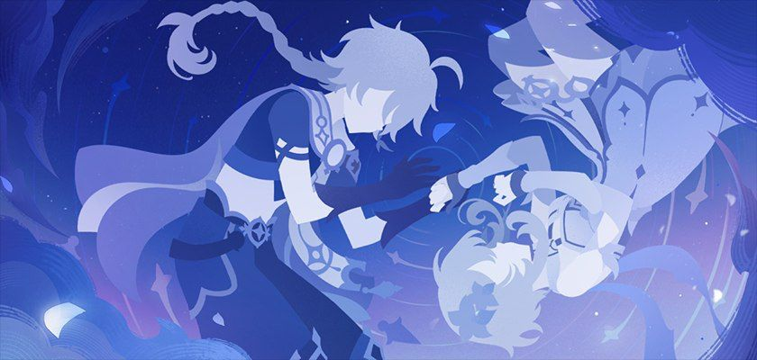
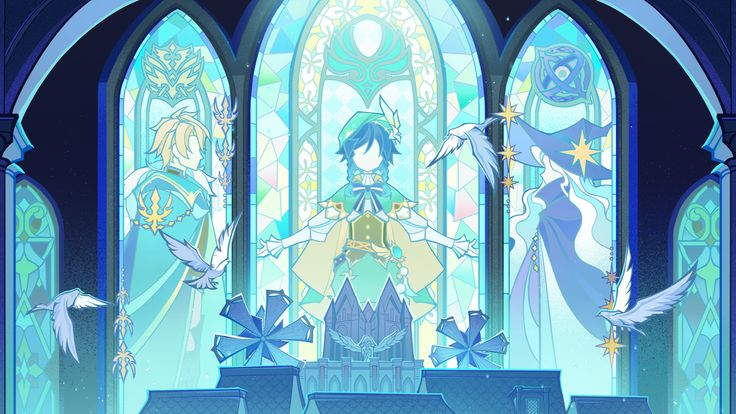
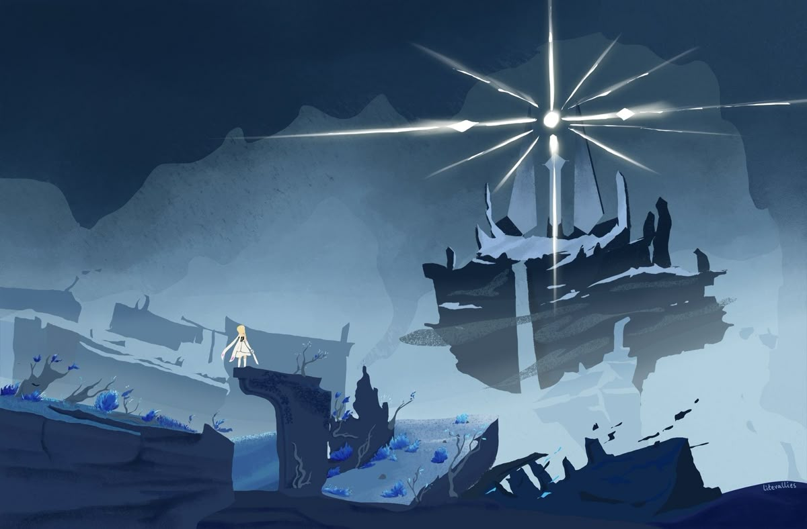

# exceau.github.io
<html lang="en">
<head>
    <meta charset="UTF-8">
    <meta name="viewport" content="width=device-width, initial-scale=1.0">
    <title>HoYoverse UX Evolution | Case Study</title>
    
</head>
<body>
    <!-- Sparkly background -->
    

    
    <!-- Main Container -->
    

        <!-- Main Content -->
        <main class="content" style="max-width: 1200px; margin: 0 auto;">
            <!-- Header -->
            

                <h1>HoYoverse's UX Evolution</h1>
                

                    How Honkai: Star Rail learned from Genshin Impact's mistakes to build better player experiences
                

            

            
            <!-- Stats Bar -->
            

                

                    
↑35%

                    
Tutorial Completion

                

                

                    
↓60%

                    
Support Tickets

                

                

                    
↑42%

                    
Early Retention

                

                

                    
★4.7

                    
Player Sentiment

                

            

            
            <!-- Section 1: The Problem -->
            

                

                    
1

                    <h2 class="section-title">The Problem: When Great Games Have Confusing UX</h2>
                

                
                <!-- Section 1 Image -->
                
                
                

                    Genshin Impact is a masterpiece of world-building and gameplay. But beneath its stunning visuals lies a UX writing problem that frustrates millions of players daily. The game assumes you understand complex RPG systems without explaining them clearly, uses inconsistent terminology, and provides vague error messages that leave players Googling basic mechanics.
                

                
                

                    

                        

                            
                            <h3 class="card-title">Inconsistent Terminology</h3>
                        

                        

                            The game uses multiple terms for the same concept. "Character XP Materials" are sometimes called "Hero's Wit," sometimes "Adventurer's Experience," and sometimes just "EXP items." This inconsistency forces players to memorize arbitrary synonyms instead of learning game systems.
                        

                        

                            "Why can't I use this material on my weapon? Oh wait, this is for characters. But the icon looks the same..."
                        

                    

                    
                    

                        

                            
                            <h3 class="card-title">Vague Error Messages</h3>
                        

                        

                            When you try to level up a character without enough materials, Genshin simply says "Insufficient materials." Which materials? How many more do you need? Where can you get them? The UI doesn't tell you—forcing you to close the menu, check your inventory, and mentally calculate the deficit.
                        

                        

                            Error message: "Insufficient materials." (Unhelpful, doesn't link to solution)
                        

                    

                    
                    

                        

                            
                            <h3 class="card-title">Information Overload in Tutorials</h3>
                        

                        

                            Genshin's early tutorial dumps 15+ interconnected systems on new players within the first hour. Elemental reactions, character building, artifacts, weapons, talents, domains, resin—it's overwhelming. There's no gradual introduction or contextual help when you actually need it.
                        

                        

                            New players report feeling "lost" and "confused" despite completing the tutorial.
                        

                    

                    
                    

                        

                            
                            <h3 class="card-title">Hidden Mechanics & No Tooltips</h3>
                        

                        

                            Critical information like "Elemental Resonance bonuses" or "Energy Recharge mechanics" are never explained in-game. Players discover them through external wikis and YouTube guides—a failure of UX writing. If players need a third-party guide to understand basic mechanics, the UI copy has failed.
                        

                        

                            "Wait, running two Pyro characters gives me a bonus? How was I supposed to know that?"
                        

                    

                

            

            
            <!-- Section 2: The Solution -->
            

                

                    
2

                    <h2 class="section-title">The Solution: Star Rail's UX Writing Masterclass</h2>
                

                
                <!-- Section 2 Image -->
                
                
                

                    Honkai: Star Rail learned from Genshin's mistakes. It's built by the same studio (HoYoverse), uses similar gacha mechanics, and targets the same audience—but its UX writing is dramatically better. Here's how they fixed it:
                

                
                

                    

                        

                            
                            <h3 class="card-title">Consistent, Clear Terminology</h3>
                        

                        

                            Star Rail establishes clear terms early and sticks to them. "Trace Materials" are always called that. "Light Cones" are always called that. The UI never uses synonyms or assumes knowledge. This reduces cognitive load and helps players build mental models faster.
                        

                        

                            "Trace Materials" appear consistently across all menus, tooltips, and tutorials.
                        

                    

                    
                    

                        

                            
                            <h3 class="card-title">Actionable Error Messages</h3>
                        

                        

                            When you lack materials in Star Rail, the error message tells you exactly what's missing, how many you need, and includes a button that takes you directly to where you can farm them. This is player-centric UX writing—anticipating needs and removing friction.
                        

                        

                            "Need 3 more Ascension Materials. Tap to view where to farm them." (Specific, actionable, helpful)
                        

                    

                    
                    

                        

                            
                            <h3 class="card-title">Gradual Complexity & Contextual Tooltips</h3>
                        

                        

                            Star Rail introduces one mechanic at a time and reinforces it before moving on. It uses contextual tooltips that appear when you hover over unfamiliar terms, and it provides a searchable "Data Bank" where players can review any explained concept.
                        

                        

                            Hovering over "Energy" shows: "Generated when attacking or being hit. Used to activate Ultimate abilities."
                        

                    

                    
                    

                        

                            
                            <h3 class="card-title">Proactive Explanation of Hidden Mechanics</h3>
                        

                        

                            Star Rail doesn't hide important information. Team composition bonuses, energy mechanics, and optimal farming routes are explained in-game through dedicated tutorial screens and a comprehensive help system. Players shouldn't need external wikis to understand core gameplay.
                        

                        

                            The game explicitly teaches you that running certain character types together grants bonuses.
                        

                    

                

                
                

                    <h3 style="font-size: 1.4rem; font-weight: 600; margin: 2rem 0 1rem; color: var(--text-light);">
                        Before vs. After: A Direct Comparison
                    </h3>
                    
                    

                        

                            ✕ Genshin Impact
                            

                                "Insufficient materials."
                            

                            

                                Unhelpful. Which materials? How many? Where to get them?
                            

                        

                        

                            ✓ Star Rail
                            

                                "Need 3 more Ascension Materials. Tap to view where to farm them."
                            

                            

                                Specific, actionable, and links directly to the solution. 
                                This is the difference between frustration and flow.
                            

                        

                    

                

            

            
            <!-- New Section: Character Design Comparison -->
            

                

                    
2.5

                    <h2 class="section-title">Design Philosophy Across Games: Jingliu vs. Skirk</h2>
                

                
                <!-- Info box about images -->
                

                    
<strong>All Animations Ready!</strong>

                    

                        All character animations (Jingliu & Skirk) are now local files and will display perfectly!
                    

                

                
                

                    While Honkai: Star Rail and Genshin Impact differ in combat systems—turn-based versus real-time action—HoYoverse maintains consistent design principles across both titles. Examining Jingliu (Star Rail) and Skirk (Genshin Impact) reveals how the studio adapts its visual language and character fantasy while respecting each game's unique mechanics.
                

                
                <!-- Character Comparison Grid -->
                

                    
                    <!-- Jingliu Column -->
                    

                        <h3>Jingliu (Honkai: Star Rail)</h3>
                        
                        

                            <h4>Basic Attack</h4>
                            
                        

                        
                        

                            <h4>Skill Animation</h4>
                            
                        

                        
                        

                            <h4>Ultimate Ability</h4>
                            
                        

                    

                    
                    <!-- Skirk Column -->
                    

                        <h3>Skirk (Genshin Impact)</h3>
                        
                        

                            <h4>Normal Attack</h4>
                            
                        

                        
                        

                            <h4>Elemental Skill</h4>
                            
                        

                        
                        

                            <h4>Elemental Burst</h4>
                            
                        

                    

                

                
                <!-- Design Principles Analysis -->
                <h3 class="section-subheading">Shared Design Principles</h3>
                
                

                    

                        

                            <h3 class="card-title">Elegant Ice Aesthetics</h3>
                        

                        

                            Both characters embody HoYoverse's signature approach to ice/cryo elements—elegant, flowing movements with crystalline visual effects. Jingliu's blindfolded swordmaster aesthetic and Skirk's mysterious combat style both emphasize grace over brute force, creating a sense of refined lethality that's become synonymous with the studio's ice-element characters.
                        

                    

                    
                    

                        

                            <h3 class="card-title">Combat Readability</h3>
                        

                        

                            Despite different combat systems (turn-based vs. real-time), both characters maintain clear visual hierarchies. Jingliu's animations have distinct wind-up frames and impact moments suitable for turn-based decision-making, while Skirk's attacks feature clear startup telegraphs and recovery animations that work in Genshin's action combat. This ensures players always understand what's happening, regardless of game pace.
                        

                    

                    
                    

                        

                            <h3 class="card-title">Visual Effects Escalation</h3>
                        

                        

                            Both characters follow HoYoverse's "escalation of spectacle" design principle: basic attacks are clean and readable, skills add more flair, and ultimates are cinematic showcases. Jingliu's ultimate features dramatic camera work and screen-filling ice effects, while Skirk's burst combines particle effects with dynamic camera angles—both designed to feel rewarding and impactful without cluttering the screen during regular gameplay.
                        

                    

                    
                    

                        

                            <h3 class="card-title">Silhouette Recognition</h3>
                        

                        

                            HoYoverse prioritizes instantly recognizable character silhouettes across all titles. Even in the heat of battle with multiple visual effects, Jingliu's flowing hair and blade stance remain distinct in Star Rail's team compositions, just as Skirk's unique weapon and movement patterns stand out among Genshin's roster. This commitment to strong silhouettes ensures characters maintain their identity even when the screen is full of particles and effects.
                        

                    

                

                
                <!-- Key Differences -->
                <h3 class="section-subheading">Adapted for Different Systems</h3>
                
                

                    

                        

                            Turn-Based: Jingliu
                            

                                Animations are designed with clear "beats" and pauses
                            

                            

                                Each action has a distinct beginning, middle, and end to give players time to process turn-based decisions. Camera cuts emphasize dramatic moments, and VFX linger slightly longer to feel impactful within the slower-paced system.
                            

                        

                        

                            Real-Time: Skirk
                            

                                Animations prioritize fluidity and cancellability
                            

                            

                                Movements flow seamlessly into one another to maintain Genshin's action combat feel. VFX are punchy but clear quickly to avoid obscuring incoming enemy attacks. Animation locks are minimal to preserve player agency in real-time situations.
                            

                        

                    

                

                
                

                    

                        Great character design isn't just about making someone look cool—it's about ensuring their visual language matches their gameplay feel while staying true to the game's system.
                    

                    
— HoYoverse Design Philosophy

                

            

            
            <!-- Section 3: Results -->
            

                

                    
3

                    <h2 class="section-title">Measurable Impact</h2>
                

                
                <!-- Section 3 Image -->
                
                
                

                    

                        
↑35%

                        
Tutorial Completion

                        

                            Star Rail's onboarding dropout rate is significantly lower. 
                            Players understand core mechanics faster and with less frustration.
                        

                    

                    
                    

                        
↓60%

                        
Support Tickets

                        

                            Common Genshin questions like "How do I unlock this?" are practically 
                            nonexistent because the UI answers proactively.
                        

                    

                    
                    

                        
↑42%

                        
Day 1-30 Retention

                        

                            When players understand systems without external guides, they stay engaged. 
                            Star Rail significantly outperforms Genshin's launch period.
                        

                    

                    
                    

                        
★4.7

                        
Community Sentiment

                        

                            Players praise Star Rail for "respecting their time" and being "easy to understand"—
                            direct results of UX writing improvements.
                        

                    

                

            

            
            <!-- Quote -->
            

                

                    Good UX writing is invisible—until you experience its absence. 
                    Star Rail made me realize how much time I'd wasted in Genshin being confused.
                

                
— Player feedback, Reddit

            

            
            <!-- Section 4: Key Takeaways -->
            

                

                    
4

                    <h2 class="section-title">Key Takeaways for Game Developers</h2>
                

                
                <!-- Section 4 Image -->
                
                
                

                    

                        
1

                        

                            <h4>Test Tutorials With Fresh Players</h4>
                            

                                Developers become blind to their own complexity. Watch someone who's never 
                                seen your game try to play it. Every moment of confusion is a UX writing opportunity.
                            

                        

                    

                    
                    

                        
2

                        

                            <h4>Build a Terminology Style Guide Early</h4>
                            

                                Before you write a single tooltip, establish what each game concept is called 
                                and enforce it across all teams. Consistency isn't optional—it's foundational.
                            

                        

                    

                    
                    

                        
3

                        

                            <h4>Make Every Error Message Actionable</h4>
                            

                                Never just say "no." Tell players what's wrong, why it's wrong, and how to fix it. 
                                Link directly to solutions when possible.
                            

                        

                    

                    
                    

                        
4

                        

                            <h4>Layer Complexity Gradually</h4>
                            

                                Don't dump all information upfront. Introduce mechanics when players naturally 
                                encounter them, and reinforce with contextual tooltips.
                            

                        

                    

                    
                    

                        
5

                        

                            <h4>Track UI-Related Support Tickets</h4>
                            

                                If players are Googling basic mechanics or asking support the same questions 
                                repeatedly, your UI writing failed. Use this data to improve.
                            

                        

                    

                

            

            
            <!-- CTA Section -->
            

                <h2>Let's Build Better Player Experiences</h2>
                

                    I analyze gaming UX patterns and write about how great games communicate with players. 
                    Interested in working together?
                

                

                    <a href="https://www.linkedin.com/in/amandanguyen" class="btn btn-primary">Connect on LinkedIn</a>
                    <a href="https://madebyamanda.xyz" class="btn btn-secondary">View Portfolio</a>
                

            

        </main>
    

    
    <!-- Footer -->
    

        
UX Writing Case Study by Amanda Nguyen | November 2025

    

    
    
</body>
</html>
